# Frontend Mentor - Space tourism website solution

This is a solution to the [Space tourism website challenge on Frontend Mentor](https://www.frontendmentor.io/challenges/space-tourism-multipage-website-gRWj1URZ3). Frontend Mentor challenges help you improve your coding skills by building realistic projects.

## Table of contents

- [Overview](#overview)
  - [The challenge](#the-challenge)
  - [Screenshot](#screenshot)
  - [Links](#links)
- [My process](#my-process)
  - [Built with](#built-with)
  - [What I learned](#what-i-learned)
  - [Continued development](#continued-development)
- [Author](#author)

.\*\*

## Overview

### The challenge

Users should be able to:

- View the optimal layout for each of the website's pages depending on their device's screen size
- See hover states for all interactive elements on the page
- View each page and be able to toggle between the tabs to see new information

### Screenshot

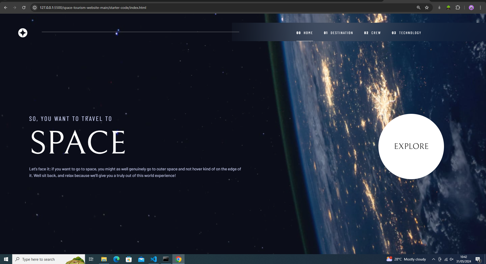
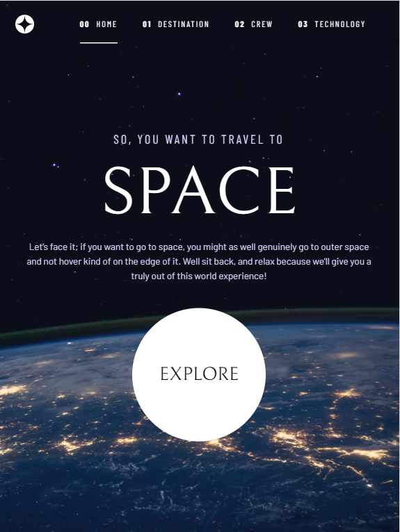
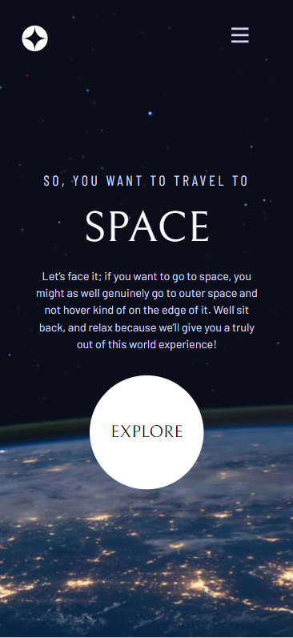
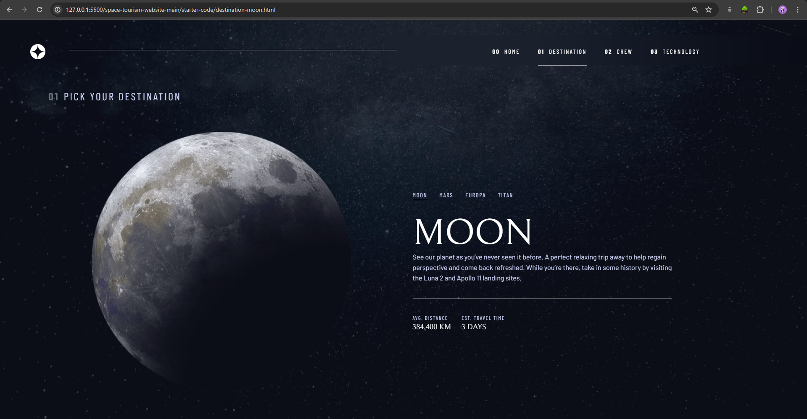
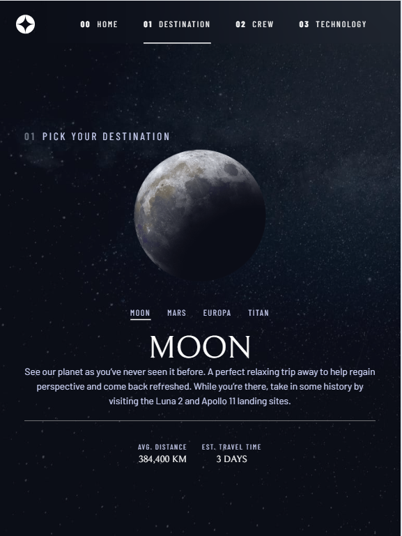
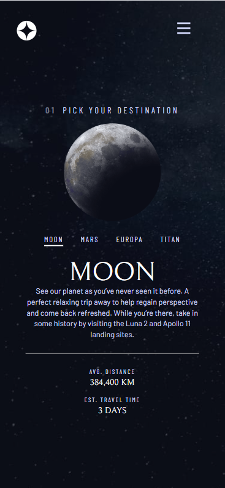
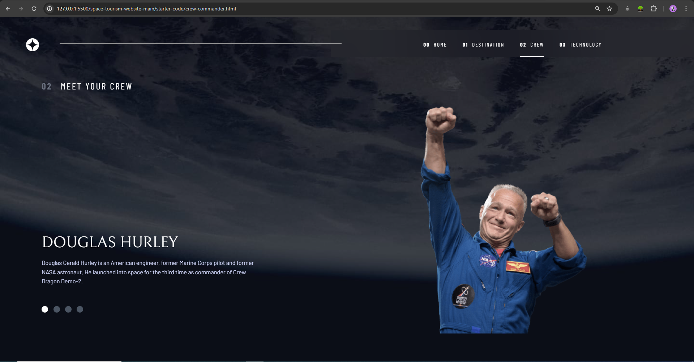
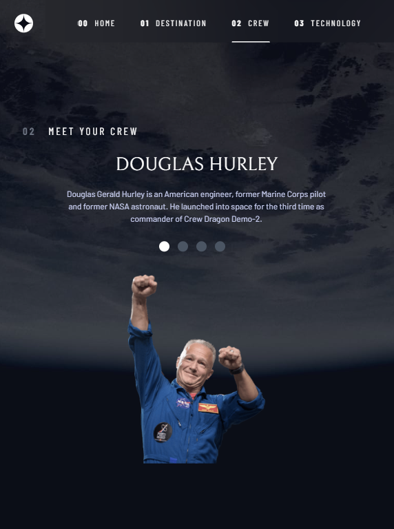
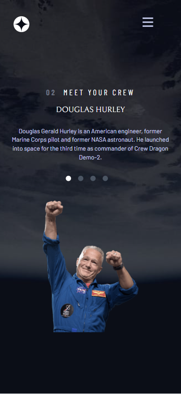
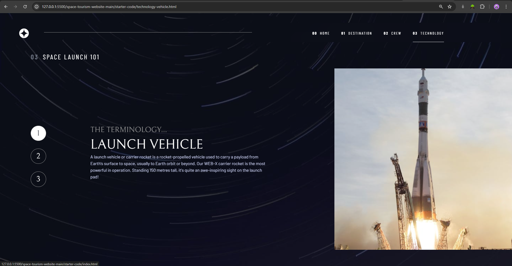
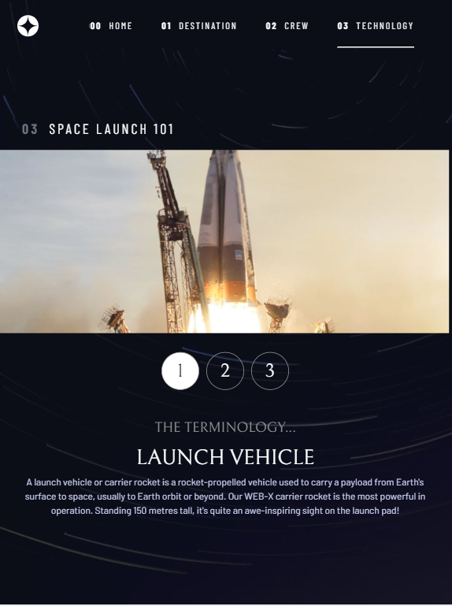
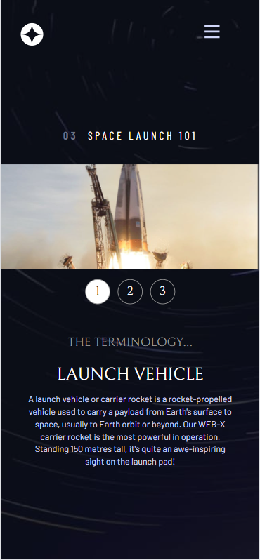

### Links

- Live Site URL: [Add live site URL here](https://your-live-site-url.com)

## My process

### Built with

- Semantic HTML5 markup
- CSS custom properties
- Flexbox
- Mobile-first workflow
- [Vue.js](https://vuejs.org/) - JS framework
- [Tailwind CSS](https://tailwindcss.com/) - For styles

### What I learned

Coping and pasting of reusable codes throughout a project is not an effective practice. I had a hard time making changes across the duplicated codes across the project after fixing a bug or an update.

### Continued development

I want incorporate the use of vue components for reusable codes in projects. For example, the navigation bar of this project should have been a component rather than being copied and pasted throughout the project.

## Author

- Author - [Precious Hobobo]
- Frontend Mentor - [@tammi3](https://www.frontendmentor.io/profile/tammi3)
- GitHub - [@tammi3](https://github.com/tammi3)
